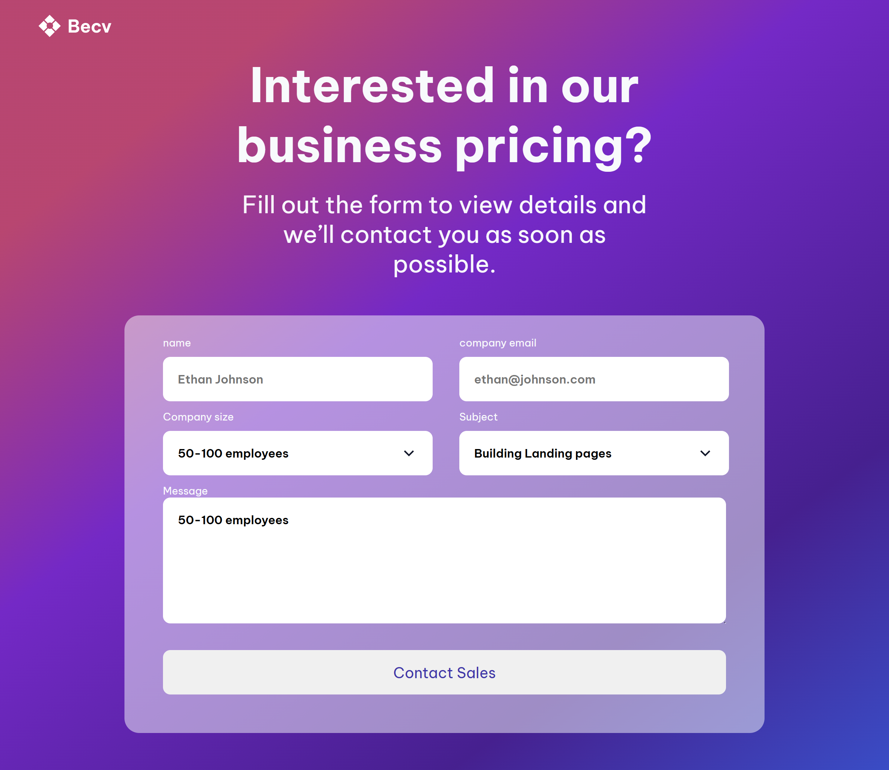

# Formulario de Contacto

Proyecto de formulario de contacto con un diseño moderno, ideal para captar consultas comerciales y solicitudes de contacto.

## Características

- **Diseño Responsivo**: Adaptación a diferentes tamaños de pantalla (PC, tableta y smartphone) mediante el uso de media queries.
- **Formulario Personalizable**: Campos como nombre, email, tamaño de la empresa, asunto y mensaje.
- **Interfaz de Usuario Moderna**: Estilos visuales con colores claros y efectos de entrada para mejorar la experiencia de usuario.
- **Uso de Google Fonts**: Fuentes modernas que mejoran la apariencia tipográfica.
- **Íconos de Font Awesome**: Para añadir iconos que complementan el diseño y la usabilidad.

## Tecnologías Utilizadas

- **HTML**: Para la estructura del formulario y sus campos.
- **CSS**: Para el diseño visual y la disposición del formulario.
- **Font Awesome**: Para iconos adicionales.
- **Google Fonts**: Para las fuentes tipográficas.

## Vista Previa del Proyecto



## Cómo Ejecutarlo Localmente

1. Clona el repositorio:
    ```bash
    git clone https://github.com/tu-usuario/nombre-del-repositorio.git
    ```
2. Navega a la carpeta del proyecto:
    ```bash
    cd nombre-del-repositorio
    ```
3. Abre el archivo `index.html` en tu navegador para ver el formulario.

## Estructura del Proyecto

```bash
/
├── index.html
├── style.css
├── img/
│   ├── contact-form-icon.svg
│   ├── bg-image.svg
│   └── vista.png
└── README.md
